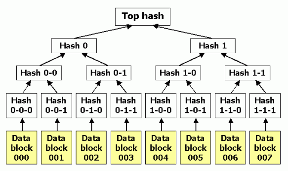

# block_chain_study

## Merkle Tree 알고리즘 설명

1.	Leaf Nodes: 각 트랜잭션의 해시 값을 리프 노드로 설정합니다.
2.	Parent Nodes: 리프 노드를 쌍으로 묶어, 각 쌍의 해시 값을 계산하여 부모 노드를 만듭니다.
3.	Merkle Root: 이 과정을 반복하여 최종적으로 하나의 해시 값을 계산합니다. 이 해시 값이 머클 루트입니다.

## Algorithm Steps in calculateMerkleRoot Method
1.	Initialize Tree: 각 트랜잭션의 해시 값을 초기 트리 배열에 저장합니다.
2.	Pair and Hash: 트랜잭션 해시들을 쌍(pair)으로 묶어, 각 쌍의 해시 값을 계산하여 부모 노드로 만듭니다.
3.	Repeat: 부모 노드들을 새로운 트리 배열에 저장하고, 트리의 크기가 1이 될 때까지 이 과정을 반복합니다.
4.	Return Root: 최종 트리 배열의 유일한 요소가 머클 루트가 됩니다.
